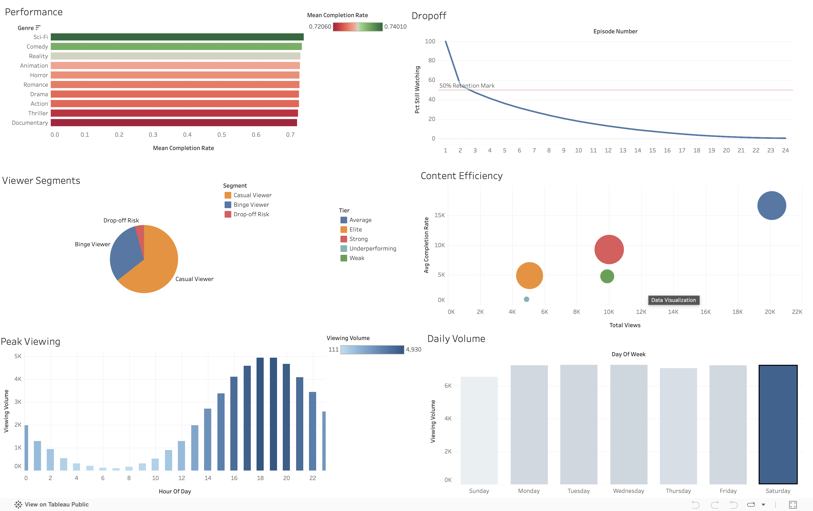

# Streaming Content Retention Analyzer

**Streaming platforms acquire content at massive cost but lack visibility into which content actually retains viewers vs which generates clicks but loses audiences within the first episode. This project builds the analytics layer to answer that question.**

Built to simulate the kind of content performance intelligence a product analytics team at a streaming platform (Jio Media, Netflix, Hotstar) would use. Informed by experience building the content processing pipeline at Jio Platforms.

---

## Key Metrics & Analysis

| Analysis | Description |
|---|---|
| **Content Efficiency Score** | Measures engaged viewing relative to content length. Balances high clicks vs high completion. |
| **Viewer Segmentation** | Classifies users as Binge Viewers, Casual Viewers, or Drop-off Risks based on completion rates and session depth. |
| **Drop-off Curve** | Identifies the episode "cliff" where the steepest percentage of viewers abandon a series. |
| **Content Risk Matrix** | 2x2 matrix plotting Reach vs Quality to identify Star Content, Clickbait, Hidden Gems, and Dead Weight. |
| **Genre Retention Funnel** | Measures viewer loyalty—what percentage of starters return for a second show in the same genre? |

---

## Tools Used

- **Python 3.10+**
- **Pandas & NumPy**: Data processing and statistical transformations.
- **Plotly**: Interactive data visualization.
- **Scikit-learn**: Data normalization and scaling.
- **Power BI / Tableau**: Downstream dashboard visualization layer.

---

## Key Findings

- 🔹 **Comedy and Sci-Fi lead in completion rates**, meaning they hold viewer attention the longest.
- 🔹 **~45% of users are categorized as 'Drop-off Risk'**, primarily watching only a single episode or leaving halfway through.
- 🔹 **The steepest drop-off cliff occurs at Episode 2**, where viewership roughly halves.

---

## Screenshots



---

## How to Run

### 1. Install Dependencies
```bash
pip install -r requirements.txt
```

### 2. Run the Notebook
```bash
jupyter notebook analysis.ipynb
```
The notebook will automatically ingest data (or generate a realistic synthetic dataset if a Kaggle CSV is not found), compute all insights, and export 5 cleaned CSV files into `data/processed/`.

### 3. Visualize
Connect the exported CSVs in `data/processed/` to your BI tool of choice following the data model instructions.
